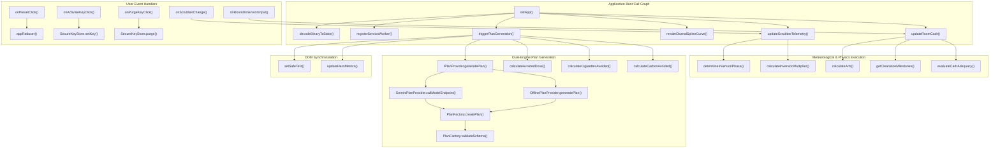

<!-- Generated by pipeline Step 13 — do not edit manually -->

```mermaid
flowchart TD
    subgraph Initialization ["Application Boot Call Graph"]
        initApp["initApp()"] --> decodeBinaryToState["decodeBinaryToState()"]
        initApp --> registerServiceWorker["registerServiceWorker()"]
        initApp --> updateScrubberTelemetry["updateScrubberTelemetry()"]
        initApp --> renderDiurnalSplineCurve["renderDiurnalSplineCurve()"]
        initApp --> updateRoomCadr["updateRoomCadr()"]
        initApp --> triggerPlanGeneration["triggerPlanGeneration()"]
    end

    subgraph UserInteraction ["User Event Handlers"]
        onPresetClick["onPresetClick()"] --> appReducer["appReducer()"]
        onScrubberChange["onScrubberChange()"] --> updateScrubberTelemetry
        onRoomDimensionInput["onRoomDimensionInput()"] --> updateRoomCadr
        onActivateKeyClick["onActivateKeyClick()"] --> setKey["SecureKeyStore.setKey()"]
        onPurgeKeyClick["onPurgeKeyClick()"] --> purgeKey["SecureKeyStore.purge()"]
    end

    subgraph InversionAndPhysics ["Meteorological & Physics Execution"]
        updateScrubberTelemetry --> determineInversionPhase["determineInversionPhase()"]
        updateScrubberTelemetry --> calculateInversionMultiplier["calculateInversionMultiplier()"]
        updateRoomCadr --> calculateAch["calculateAch()"]
        updateRoomCadr --> getClearanceMilestones["getClearanceMilestones()"]
        updateRoomCadr --> evaluateCadrAdequacy["evaluateCadrAdequacy()"]
    end

    subgraph PlanGeneration ["Dual-Engine Plan Generation"]
        triggerPlanGeneration --> generatePlan["IPlanProvider.generatePlan()"]
        generatePlan --> callGemini["GeminiPlanProvider.callModelEndpoint()"]
        generatePlan --> generateOffline["OfflinePlanProvider.generatePlan()"]
        callGemini --> PlanFactoryCreate["PlanFactory.createPlan()"]
        generateOffline --> PlanFactoryCreate
        PlanFactoryCreate --> validateSchema["PlanFactory.validateSchema()"]
        triggerPlanGeneration --> calculateAvoidedDose["calculateAvoidedDose()"]
        triggerPlanGeneration --> calculateCigarettesAvoided["calculateCigarettesAvoided()"]
        triggerPlanGeneration --> calculateCarbonAvoided["calculateCarbonAvoided()"]
    end

    subgraph DomRendering ["DOM Synchronization"]
        triggerPlanGeneration --> setSafeText["setSafeText()"]
        triggerPlanGeneration --> updateHeroMetrics["updateHeroMetrics()"]
    end
```
